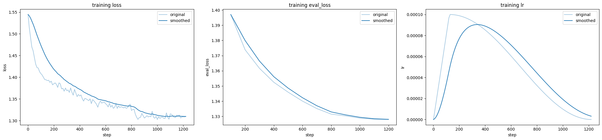
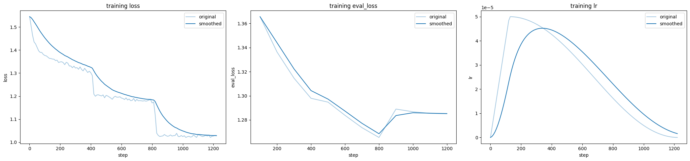
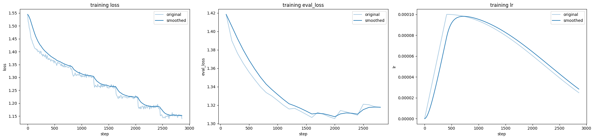
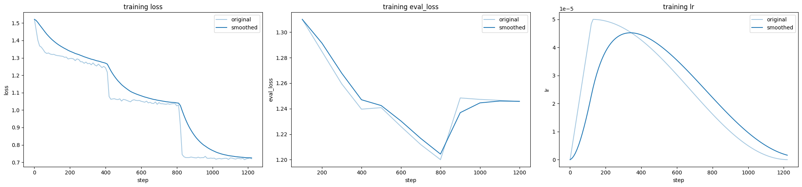

```python
from pathlib import Path
from utils import plot_loss, sync_logs
```


```python
dirs = [
    '/home/app.e0016372/wkspace/train/pt/lora/qwen2.5-32b-instruct-pt-v1',
    '/home/app.e0016372/wkspace/train/pt/full/qwen2.5-32b-instruct-pt-v1',
    '/home/app.e0016372/wkspace/train/pt/lora/qwen2.5-32b-instruct-pt-v2',
    '/home/app.e0016372/wkspace/train/pt/full/qwen2.5-72b-instruct-pt-v1',
]
```


```python
for p in dirs: plot_loss(p)
```


<style>
    .dataframe {
        width: 100%;
    }
    .dataframe th {
        background-color: #3498db;
        text-align: center;
        color: white;
    }
    .dataframe td {
        text-align: center;
    }
    .dataframe-title {
        text-align: center;
        font-weight: bold;
        font-size: 1.5em;
    }
</style>
<div class="dataframe-title">/home/app.e0016372/wkspace/train/pt/lora/qwen2.5-32b-instruct-pt-v1</div><table border="1" class="dataframe dataframe">
  <thead>
    <tr style="text-align: right;">
      <th>current_steps</th>
      <th>total_steps</th>
      <th>loss</th>
      <th>lr</th>
      <th>epoch</th>
      <th>percentage</th>
      <th>elapsed_time</th>
      <th>remaining_time</th>
      <th>eval_loss</th>
    </tr>
  </thead>
  <tbody>
    <tr>
      <td>1200</td>
      <td>1224</td>
      <td>NaN</td>
      <td>NaN</td>
      <td>2.942042</td>
      <td>98.04</td>
      <td>2025-07-01 09:41:44</td>
      <td>2025-07-01 00:11:38</td>
      <td>1.327934</td>
    </tr>
    <tr>
      <td>1200</td>
      <td>1224</td>
      <td>NaN</td>
      <td>NaN</td>
      <td>2.942042</td>
      <td>98.04</td>
      <td>2025-07-01 09:41:44</td>
      <td>2025-07-01 00:11:38</td>
      <td>1.327934</td>
    </tr>
    <tr>
      <td>1224</td>
      <td>1224</td>
      <td>NaN</td>
      <td>NaN</td>
      <td>3.000000</td>
      <td>100.00</td>
      <td>2025-07-01 09:54:58</td>
      <td>2025-07-01 00:00:00</td>
      <td>NaN</td>
    </tr>
  </tbody>
</table>


    

    


<style>
    .dataframe {
        width: 100%;
    }
    .dataframe th {
        background-color: #3498db;
        text-align: center;
        color: white;
    }
    .dataframe td {
        text-align: center;
    }
    .dataframe-title {
        text-align: center;
        font-weight: bold;
        font-size: 1.5em;
    }
</style>
<div class="dataframe-title">/home/app.e0016372/wkspace/train/pt/full/qwen2.5-32b-instruct-pt-v1</div><table border="1" class="dataframe dataframe">
  <thead>
    <tr style="text-align: right;">
      <th>current_steps</th>
      <th>total_steps</th>
      <th>loss</th>
      <th>lr</th>
      <th>epoch</th>
      <th>percentage</th>
      <th>elapsed_time</th>
      <th>remaining_time</th>
      <th>eval_loss</th>
    </tr>
  </thead>
  <tbody>
    <tr>
      <td>800</td>
      <td>1224</td>
      <td>NaN</td>
      <td>NaN</td>
      <td>1.960784</td>
      <td>65.36</td>
      <td>2025-07-01 08:11:34</td>
      <td>2025-07-01 04:20:32</td>
      <td>1.265471</td>
    </tr>
    <tr>
      <td>1200</td>
      <td>1224</td>
      <td>NaN</td>
      <td>NaN</td>
      <td>2.941176</td>
      <td>98.04</td>
      <td>2025-07-01 12:20:55</td>
      <td>2025-07-01 00:14:49</td>
      <td>1.285147</td>
    </tr>
    <tr>
      <td>1224</td>
      <td>1224</td>
      <td>NaN</td>
      <td>NaN</td>
      <td>3.000000</td>
      <td>100.00</td>
      <td>2025-07-01 12:43:48</td>
      <td>2025-07-01 00:00:00</td>
      <td>NaN</td>
    </tr>
  </tbody>
</table>


    

    


<style>
    .dataframe {
        width: 100%;
    }
    .dataframe th {
        background-color: #3498db;
        text-align: center;
        color: white;
    }
    .dataframe td {
        text-align: center;
    }
    .dataframe-title {
        text-align: center;
        font-weight: bold;
        font-size: 1.5em;
    }
</style>
<div class="dataframe-title">/home/app.e0016372/wkspace/train/pt/lora/qwen2.5-32b-instruct-pt-v2</div><table border="1" class="dataframe dataframe">
  <thead>
    <tr style="text-align: right;">
      <th>current_steps</th>
      <th>total_steps</th>
      <th>loss</th>
      <th>lr</th>
      <th>epoch</th>
      <th>percentage</th>
      <th>elapsed_time</th>
      <th>remaining_time</th>
      <th>eval_loss</th>
    </tr>
  </thead>
  <tbody>
    <tr>
      <td>2000</td>
      <td>4080</td>
      <td>NaN</td>
      <td>NaN</td>
      <td>4.902791</td>
      <td>49.02</td>
      <td>2025-07-01 15:51:35</td>
      <td>16:29:39</td>
      <td>1.305410</td>
    </tr>
    <tr>
      <td>2800</td>
      <td>4080</td>
      <td>NaN</td>
      <td>NaN</td>
      <td>6.863539</td>
      <td>68.63</td>
      <td>2025-07-01 22:13:47</td>
      <td>10:09:43</td>
      <td>1.317664</td>
    </tr>
    <tr>
      <td>2860</td>
      <td>4080</td>
      <td>1.14</td>
      <td>0.000025</td>
      <td>7.009813</td>
      <td>70.10</td>
      <td>2025-07-01 22:41:51</td>
      <td>9:40:56</td>
      <td>NaN</td>
    </tr>
  </tbody>
</table>


    

    


<style>
    .dataframe {
        width: 100%;
    }
    .dataframe th {
        background-color: #3498db;
        text-align: center;
        color: white;
    }
    .dataframe td {
        text-align: center;
    }
    .dataframe-title {
        text-align: center;
        font-weight: bold;
        font-size: 1.5em;
    }
</style>
<div class="dataframe-title">/home/app.e0016372/wkspace/train/pt/full/qwen2.5-72b-instruct-pt-v1</div><table border="1" class="dataframe dataframe">
  <thead>
    <tr style="text-align: right;">
      <th>current_steps</th>
      <th>total_steps</th>
      <th>loss</th>
      <th>lr</th>
      <th>epoch</th>
      <th>percentage</th>
      <th>elapsed_time</th>
      <th>remaining_time</th>
      <th>eval_loss</th>
    </tr>
  </thead>
  <tbody>
    <tr>
      <td>800</td>
      <td>1224</td>
      <td>NaN</td>
      <td>NaN</td>
      <td>1.960784</td>
      <td>65.36</td>
      <td>2025-07-01 08:30:11</td>
      <td>2025-07-01 04:30:24</td>
      <td>1.200028</td>
    </tr>
    <tr>
      <td>1200</td>
      <td>1224</td>
      <td>NaN</td>
      <td>NaN</td>
      <td>2.941176</td>
      <td>98.04</td>
      <td>2025-07-01 12:50:08</td>
      <td>2025-07-01 00:15:24</td>
      <td>1.245664</td>
    </tr>
    <tr>
      <td>1224</td>
      <td>1224</td>
      <td>NaN</td>
      <td>NaN</td>
      <td>3.000000</td>
      <td>100.00</td>
      <td>2025-07-01 13:22:32</td>
      <td>2025-07-01 00:00:00</td>
      <td>NaN</td>
    </tr>
  </tbody>
</table>


    

    


```python
sync_logs(dirs)
```


```python

```
